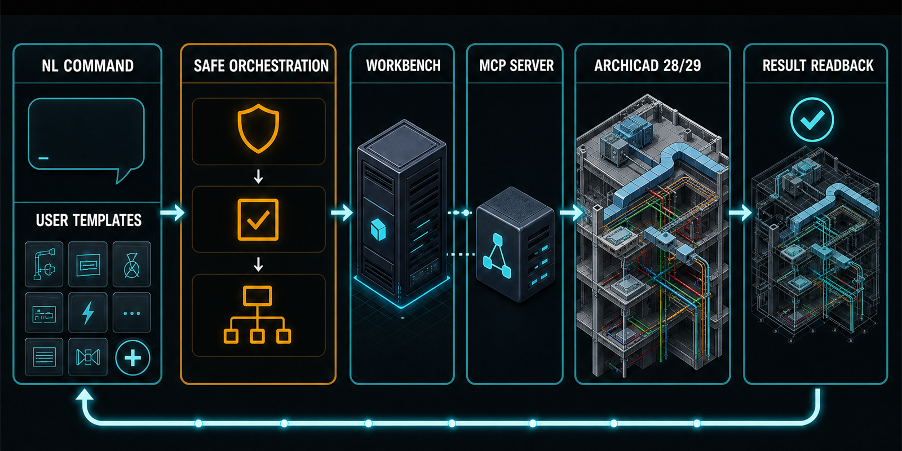
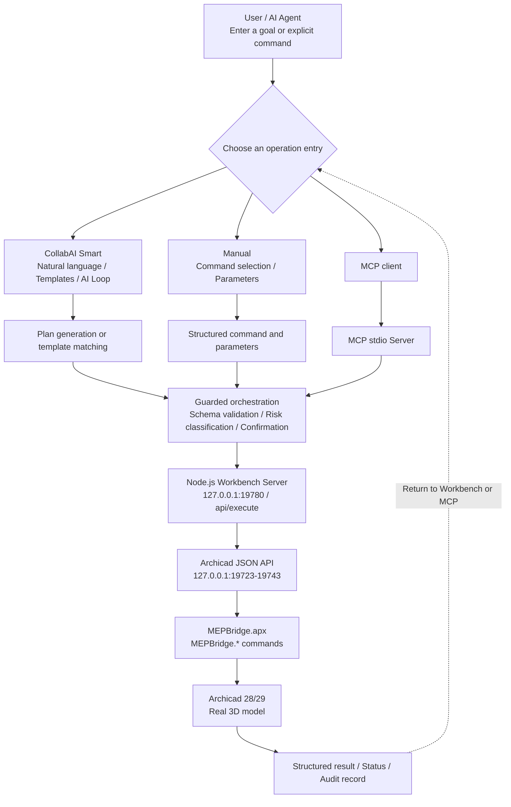

# MEPbridge ACAIstr (MACAI)

> MEPbridge ACAIstr (MACAI) is a native Add-On and local MCP / Workbench collaboration system centered on openBIM and Archicad workflows. Its initial focus is safe, controlled two-way interaction between large language models and professional 3D design software, providing natural-language interaction, structured command execution, and autonomous AI Loop capabilities for design work. The system provides `CollabAI Smart` and `Manual` as its two operation entry points; manual commands, fixed templates, and configured custom NL commands remain available without an LLM.
>
> The exploration path uses two-way MCP data exchange to progressively form an AI Loop of task planning, model execution, model-feedback readback, and corrective iteration. The initial version focuses on reliable model read/write access, risk confirmation, and result readback. Drawing interpretation, compliance checking, and multidisciplinary end-to-end design automation remain directions for continued development.

[](LICENSE)
[]()
[]()
[]()
[]()
[]()
[]()
[]()
[]()
[]()
[]()

[中文说明](README.zh-CN.md) | [Installation](docs/user/INSTALL.md) | [Quick Start](docs/user/QUICK_START.md) | [Support](.github/SUPPORT.md)

<p align="center">
  
</p>

Natural-language tasks and extensible user templates pass through planning and risk controls, the local Workbench / MCP layer, Archicad execution, and structured result readback.

## Release Scope

- Version: `v0.1.0`
- 61 registered C++ commands
- 59 descriptor/MCP tools
- Direct-only C++ commands: `SwitchStory` and `ChangeStairGeometry`
- Archicad 28 and Archicad 29 Windows builds
- Server default: `127.0.0.1:19780`
- Archicad JSON API discovery: local `127.0.0.1:19723-19743`

Public update history: [CHANGELOG.md](CHANGELOG.md).

Download the full package for your language from GitHub Releases:

- `MEPbridge-ACAIstr-v0.1.0-win64-en-US.zip`: English full package.
- `MEPbridge-ACAIstr-v0.1.0-win64-zh-CN.zip`: Chinese full package.

Do not use GitHub's automatically generated `Source code.zip` or `Source code.tar.gz`; they are not installation packages and do not contain the complete APX and runtime dependencies. Each full ZIP contains both AC28 and AC29 APXs, the Workbench Server, compiled UI, MCP Server, production dependencies, legal files, manifest, and checksums. The standalone AC28/AC29 APX assets are update-only files for users who already have a complete package installed.

The public repository provides the C2 Workbench collaboration surface: React Workbench, Node.js Server, MCP Server, core descriptors, reviewed module SDK and schema, examples, and public documentation. Contributors can build reviewed modules, compose existing Archicad commands into new workflows, extend UI panels and Server services, improve MCP integrations, and contribute examples or documentation.

The repository focuses on Workbench development and extension rather than independent APX builds. End users should install the signed-off release ZIP instead of cloning source.

## Main Capabilities

- General building elements: walls, columns, beams, slabs, roofs, doors, windows, stairs, objects, lamps, meshes, zones, and grids
- MEP domains: pipe, duct, cable carrier, flexible segment, take-off, systems, sizes, and route operations
- Model editing: move, rotate, mirror, copy, geometry changes, batch creation, selection, and deletion
- Project queries: project information, stories, libraries, hotlinks, properties, geometry, mesh, and viewport capture
- `CollabAI Smart` and `Manual` operation modes with risk classification, confirmation gates, and result readback
- MCP tools generated dynamically from `ai-adapter/tool-descriptors.json`
- Local user templates, custom commands, knowledge base, learning memory, and audit logs
- Reviewed Workbench modules loaded from `modules/registry.json`
- AC28/AC29 support with preview, confirmation, result readback, and failure handling according to operation risk

### Operation Modes

| Mode or asset | Primary use | Typical flow |
| --- | --- | --- |
| **CollabAI Smart** | Natural-language tasks, template tasks, and AI Loop | Enter a goal -> match an NL command or template -> generate a plan -> confirm risk -> execute and read back |
| **Manual** | Explicit commands, parameter control, and verification | Select a command module -> enter parameters -> confirm execution -> inspect structured results |
| **User templates** | Save and replay multi-step plans | Save, search, replay, manage, and delete verified plans |
| **Custom NL commands** | Extend local natural-language triggers | Map a trigger phrase to a single command or user template |
| **Preset management** | Manage templates and custom-command assets | Import, export, back up, and reset the `user-asset-1` bundle |

`CollabAI Smart` provides `Auto`, `Supervised`, and `Manual` execution strategies. Auto can run reads, low-risk mutations, and single-element creation directly, while higher-risk and batch operations require confirmation. Supervised always previews the plan and confirms mutation operations. Manual automatically runs only read steps and confirms the remaining steps individually. Without an LLM, `Manual`, fixed templates, and configured custom NL commands remain available; model-dependent interpretation and automatic plan generation are unavailable.

## Architecture

The vertical flow below represents one complete operation. Workbench and MCP share the Node.js Server, guarded execution entry point, and Archicad command chain before results return to the UI or MCP client.



UI and MCP model operations pass through `/api/execute`. Runtime data such as user templates, learning memory, and audit logs is stored under `%APPDATA%\MEPBridge` by default and can be overridden with `MEPBRIDGE_DATA_DIR`.

## Install

1. Download the complete `win64-en-US.zip` or `win64-zh-CN.zip` package from Releases, not an APX-only update or the automatically generated `Source code.zip` / `Source code.tar.gz`.
2. Extract it to a normal writable directory.
3. Close Archicad and run `Install-MEPBridge.cmd`.
4. Restart Archicad.
5. Use the MEPbridge ACAIstr menu to open the Workbench.

Manual Server startup is also available from a Command Prompt or PowerShell window opened in the extracted package root:

```powershell
node server\server.js
```

Then open `http://127.0.0.1:19780/`.

See [INSTALL.md](docs/user/INSTALL.md) for complete installation and MCP instructions.

## Public Source Layout

```text
ai-adapter/tool-descriptors.json
ai-adapter/ui/v0.1.0/          React UI source
server/                        Node.js Workbench Server
tools/mepbridge-mcp-server.js  MCP stdio server
tools/validate-modules.js      Reviewed module validator
modules/                       C2 module registry, SDK schema, and modules
docs/user/                     Public user documentation
docs/contributors/             Public contribution boundary
```

The open-source extension surface supports Workbench modules, UI workflows, Server routes and services, MCP integrations, descriptor-based orchestration, validation, examples, and documentation.

When a feature needs a new native Archicad command, submit a feature request describing the intended behavior, parameter contract, safety requirements, and expected AC28/AC29 results. A future release can expose the accepted capability through a reviewed descriptor.

## Workbench Development

Public Workbench requirements:

- Node.js 18+
- A release installation of MEPbridge ACAIstr for live Archicad testing

UI checks:

```powershell
cd ai-adapter\ui\v0.1.0
npm ci
npm run lint
npm run build
```

Server:

```powershell
node server\server.js
```

The Server binds to `127.0.0.1` unless `HOST` is explicitly set.

Module checks:

```powershell
node tools\validate-modules.js
node modules\project-insights\tests\module.test.js
node server\tests\extension-manager.test.js
```

See [MODULE_DEVELOPMENT.md](docs/contributors/MODULE_DEVELOPMENT.md) and [PUBLIC_SOURCE_BOUNDARY.md](docs/contributors/PUBLIC_SOURCE_BOUNDARY.md).

## Safety and Disclaimer

Use a test or backed-up PLN for write, delete, batch, and geometry-changing commands. Review target GUIDs, units, story context, and confirmation prompts before execution.

Users are responsible for ensuring that their use of the Add-On complies with applicable requirements and for their model files, input parameters, backups, and execution results. Installing or using this software constitutes acceptance of the associated risks and disclaimer.

Do not submit API keys, unredacted logs, or project-sensitive data in public issues.

## License

Licensed under the [MIT License](LICENSE). Archicad and Graphisoft are trademarks of their respective owners. See [NOTICE](NOTICE), [SECURITY.md](.github/SECURITY.md), and [SUPPORT.md](.github/SUPPORT.md).

Personal and commercial use is permitted under the MIT License, including use, modification, and distribution, provided that the copyright and license notice are retained.

**MEPbridge ACAIstr (MACAI)** — Made with AI by Zuxai Z.
&copy; 2026 Zuxai Z. &middot; MIT License — Free for personal and commercial use.
