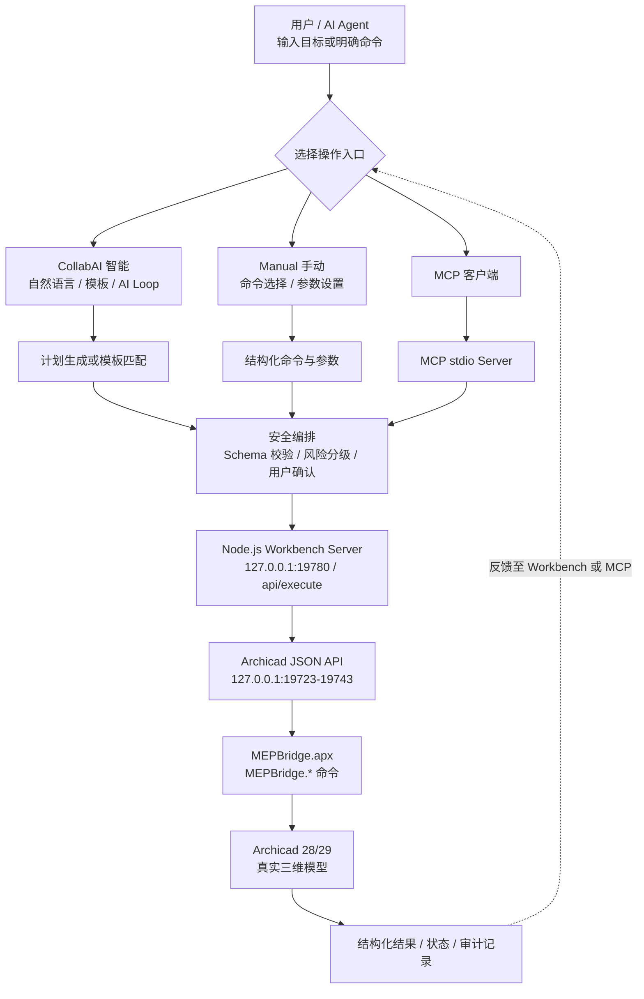

# MEPbridge ACAIstr (MACAI)

> MEPbridge ACAIstr（MACAI）是一套以 OPENBIM 与 Archicad 工作流为核心的原生 Add-On 与本地 MCP / Workbench 协同系统。基础阶段致力于打通大语言模型与专业三维设计软件之间安全、可控的双向交互，为设计工作提供自然语言对话调用、结构化命令执行与自主循环（AI Loop）能力。系统提供 `CollabAI 智能` 和 `Manual 手动` 两种操作入口；无 LLM 时仍可使用手动命令、固定模板和已配置的自定义 NL 命令。
>
> 探索方向：依托 MCP 双向数据交互，逐步形成“任务规划 → 执行建模 → 读取模型反馈 → 修正迭代”的 AI Loop。当前初始版本重点是建立可靠的模型读写、风险确认与结果回读基础；图纸解析、合规校验和建筑设计全流程、全专业智能化属于后续持续扩展方向。

[](LICENSE)
[]()
[]()
[]()
[]()
[]()
[]()
[]()
[]()
[]()
[]()

[English](README.md) | [安装说明](docs/user/INSTALL.zh-CN.md) | [快速开始](docs/user/QUICK_START.zh-CN.md) | [支持与反馈](.github/SUPPORT.md)

<p align="center">
  
</p>

自然语言任务和可扩展用户模板经过计划编排与风险控制，由本地 Workbench / MCP 层驱动 Archicad 执行，并将结构化结果回读形成操作闭环。

## 发布范围

- 版本：`v0.1.0`
- 61 个注册 C++ 命令
- 59 个 descriptor/MCP 工具
- 两个仅直接调用的 C++ 命令：`SwitchStory`、`ChangeStairGeometry`
- 支持 Archicad 28 和 Archicad 29 Windows 版本
- Server 默认地址：`127.0.0.1:19780`
- Archicad JSON API 本机检测范围：`127.0.0.1:19723-19743`

推荐用户从 GitHub Releases 下载命名为 `MEPbridge-ACAIstr-v0.1.0-*.zip` 的完整发布 ZIP。不要下载 GitHub 自动生成的 `Source code.zip` 或 `Source code.tar.gz`，它们不是安装包，不包含完整 APX 和运行依赖。正式发布 ZIP 包含 AC28/AC29 APX、Workbench Server、编译后的 UI、MCP Server、生产依赖、法律文件、发布清单和 SHA256 校验和。

公开仓库提供 C2 Workbench 开放协作能力，包括 React Workbench、Node.js Server、MCP Server、核心 descriptor、审核模块 SDK 与 schema、示例和公开文档。开发者可以新增审核模块、组合现有 Archicad 命令形成新工作流、扩展 UI 面板与 Server 服务、完善 MCP 集成，并贡献示例或文档。

本仓库面向 Workbench 开发与功能扩展，不以独立构建 APX 为目标。最终用户应下载经过验收的发布 ZIP，不需要克隆源码。

## 主要能力

- 通用建筑构件：墙、柱、梁、板、屋顶、门窗、楼梯、对象、灯具、地形、区域和轴网
- MEP 专业：管道、风管、桥架、柔性段、支管连接、系统、尺寸和路由操作
- 模型编辑：移动、旋转、镜像、复制、几何修改、批量创建、选择和删除
- 项目查询：项目信息、楼层、图库、热链接、属性、几何、网格和视口截图
- `CollabAI 智能` 与 `Manual 手动` 双入口、风险分级、确认闸门和执行结果回读
- 根据 `ai-adapter/tool-descriptors.json` 动态生成 MCP 工具
- 本地用户模板、自定义命令、知识库、学习记忆和审计日志
- 从 `modules/registry.json` 加载经过审核的 Workbench 模块
- 支持 AC28/AC29；写入和批量流程根据风险级别执行预览、确认、结果回读及必要的失败处理

### 操作方式

| 模式或资产 | 定位 | 典型操作 |
| --- | --- | --- |
| **CollabAI 智能** | 自然语言任务、模板任务和 AI Loop | 输入目标 → 匹配 NL 命令或模板 → 生成执行计划 → 风险确认 → 执行并回读 |
| **Manual 手动** | 明确命令、参数控制和调试验证 | 选择命令模块 → 填写参数 → 确认执行 → 查看结构化结果 |
| **用户模板** | 固化可重放的多步骤计划 | 保存、搜索、重放、管理和删除已验证计划 |
| **自定义 NL 命令** | 扩展本地自然语言触发方式 | 将触发短语映射到单步命令或用户模板 |
| **预设管理** | 管理用户模板和自定义命令资产 | 使用 `user-asset-1` 格式导入、导出、备份和清除重置 |

`CollabAI 智能`提供 `自动`、`监督`和`手动`三种执行策略：自动策略可直接执行只读、低风险修改和单构件创建，较高风险及批量操作需要确认；监督策略总是预览计划，并确认修改类操作；手动策略仅自动执行只读步骤，其余步骤逐步确认。无 LLM 连接时，`Manual 手动`、固定模板和已配置的自定义 NL 命令仍可使用，依赖模型推理的自然语言解析与自动计划生成不可用。

## 功能架构

以下流程按一次完整操作自上而下展示。Workbench 与 MCP 共用 Node.js Server、安全执行入口和 Archicad 命令链，执行结果再回到用户界面或 MCP 客户端。



UI 和 MCP 的模型操作统一通过 `/api/execute`。用户模板、学习记忆和审计日志等运行数据默认保存在 `%APPDATA%\MEPBridge`，可通过 `MEPBRIDGE_DATA_DIR` 指定其他目录。

## 安装

1. 从 Releases 下载完整的 `MEPbridge-ACAIstr-v0.1.0-*.zip`，不要下载自动生成的 `Source code.zip` 或 `Source code.tar.gz`。
2. 解压到普通可写目录。
3. 关闭 Archicad，双击 `Install-MEPBridge.cmd`。
4. 重新启动 Archicad。
5. 从 MEPbridge ACAIstr 插件菜单打开 Workbench。

也可以在发布包根目录打开命令提示符或 PowerShell，手动启动 Server：

```powershell
node server\server.js
```

然后打开 `http://127.0.0.1:19780/`。

完整步骤参见[安装说明](docs/user/INSTALL.zh-CN.md)。

## 公开源码目录

```text
ai-adapter/tool-descriptors.json
ai-adapter/ui/v0.1.0/          React UI 源码
server/                        Node.js Workbench Server
tools/mepbridge-mcp-server.js  MCP stdio Server
tools/validate-modules.js      审核模块校验器
modules/                       C2 模块注册表、SDK schema 和模块
docs/user/                     公开用户文档
docs/contributors/             公开协作边界
```

开源扩展范围包括 Workbench 模块、UI 工作流、Server 路由与服务、MCP 集成、基于 descriptor 的任务编排、校验逻辑、示例和文档。

如功能需要新增原生 Archicad 命令，可通过功能请求说明目标行为、参数契约、安全要求以及 AC28/AC29 预期结果；后续版本可通过审核后的 descriptor 提供该能力。

## Workbench 开发

- Node.js 18+
- 如需实机测试，安装正式发布包中的 MEPbridge ACAIstr

UI 检查：

```powershell
cd ai-adapter\ui\v0.1.0
npm ci
npm run lint
npm run build
```

Server：

```powershell
node server\server.js
```

除非显式设置 `HOST`，Server 只监听 `127.0.0.1`。

模块检查：

```powershell
node tools\validate-modules.js
node modules\project-insights\tests\module.test.js
node server\tests\extension-manager.test.js
```

参见[模块开发指南](docs/contributors/MODULE_DEVELOPMENT.md)和[公开源码边界](docs/contributors/PUBLIC_SOURCE_BOUNDARY.md)。

## 安全与免责声明

写入、删除、批量操作和几何修改应在测试或已备份的 PLN 中执行。执行前检查目标 GUID、单位、楼层和确认提示。

用户应确保插件使用符合适用规定，并对模型文件、输入参数、备份和执行结果负责。安装或使用本软件即表示接受相关风险和免责声明。

公开反馈中不得提交 API Key、未脱敏日志或项目敏感数据。

## 许可

项目使用 [MIT License](LICENSE)。Archicad 和 Graphisoft 商标归其权利人所有。参见 [NOTICE](NOTICE)、[SECURITY.md](.github/SECURITY.md) 和 [SUPPORT.md](.github/SUPPORT.md)。

个人和商业用途可按 MIT License 条款使用、修改和分发，并保留版权及许可声明。

**MEPbridge ACAIstr (MACAI)** — Made with AI by Zuxai Z.
&copy; 2026 Zuxai Z. &middot; MIT License — 个人和商业用途均可免费使用。
